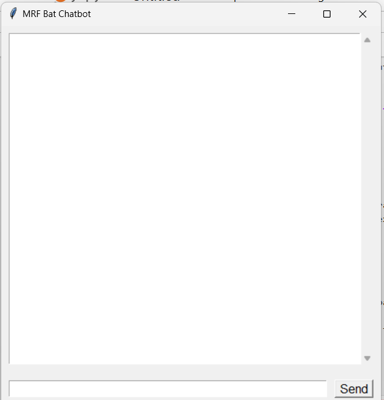

# 🏏 MRF Bat Chatbot

A simple AI chatbot built with Python to answer FAQs about **MRF cricket bats**. This chatbot uses NLP (Natural Language Processing) techniques and a GUI built with `tkinter`.



---

## 💡 Features

- Answers frequently asked questions about MRF bats  
- Uses `TF-IDF` and `cosine similarity` for understanding questions  
- GUI built using `tkinter`  
- Preprocessing using NLTK (lemmatization, stopword removal, tokenization)

---

## 🚀 Installation

1. **Clone this repository**:
   ```bash
   git clone https://github.com/yourusername/mrf-bat-chatbot.git
   cd mrf-bat-chatbot
